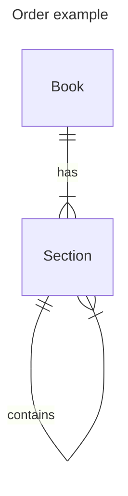
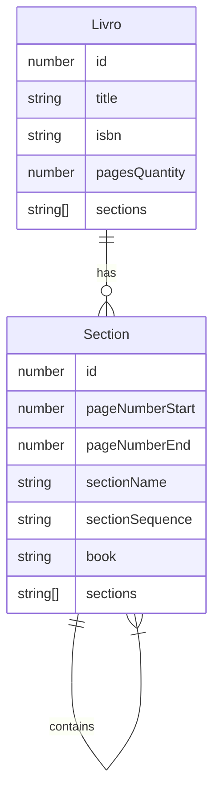

# CodeFuseChallenge

Contexto
Este projeto consiste no modelo de cadastro de livros e páginas de livros como forma de testar os meus conhecimentos e práticas sobre programação e desenvolvimento de aplicações web.

O projeto será feito usando a linguagem javascript por ter maior familiariade com a linguagem.

O objetivo final será apresentar o livro em forma de árvore onde a raíz será o livro e as páginas serão as ramificações.

modelo entidade-relacionamento

Um livro pode ter muitas seções e uma seção pode ter várias seções também.

Link da api no servidor Vercel:
https://codefuseapi.vercel.app/

Link do front no servidor Vercel:
https://codefuseui-brenoborges.vercel.app/